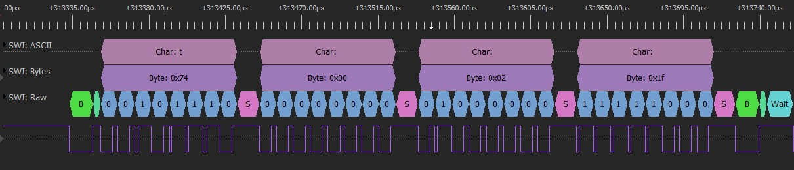

# SWI Protocol Decoder

## Описание
* Декодер протокола Apple Lightning и Apple MagSafe (MagSafe лично не проверял).
* Подходит для использования с [PulseView](https://sigrok.org/wiki/Downloads) от [sigrok](https://sigrok.org/wiki/Main_Page) и [DSView](https://www.dreamsourcelab.com/download/) от [DreamSourceLab](https://www.dreamsourcelab.com/)

## Примечаение
* Мои наблюдения показали, что напряжение на линии данных соотвествует SDQ, а протокол больше похож на HDQ, но с некоторыми отличиями.
* За основу этого декода взят декодер [sdq](https://sigrok.org/wiki/Protocol_decoder:Sdq) для [PulseView](https://sigrok.org/wiki/Downloads)
* Я назвал декодер SWI потому, что такая аббревиатура часто встречается в схемах от MacBook. Вероятно расшифровывается как Single Wire Interface (однопроводный интерфейс).
* china_lightning_usb_2.0_iphone_7.dsl - файл с обменом между китайским Lightning и iPhone 7

## Установка
* [Скачать ZIP-архив](https://github.com/S-LABc/SWI-Protocol-Decoder/releases/download/v1.0/swi.zip) последней версии из раздела [Releases](https://github.com/S-LABc/SWI-Protocol-Decoder/releases)
* Для [DSView](https://www.dreamsourcelab.com/download/) извлечь содержимое скаченного архива в папку **decoders**. Путь по умолчанию *C:\Program Files\DSView\decoders*.

## Ссылки
* [Официальный сайт DreamSourceLab](https://www.dreamsourcelab.com/)
* [Официальный сайт sigrok](https://sigrok.org/wiki/Main_Page)
* [Программа DSView](https://www.dreamsourcelab.com/download/)
* [Программа PulseView](https://sigrok.org/wiki/Downloads)
* [Список декодеров](https://sigrok.org/wiki/Protocol_decoders)
* [Исходник декодера sdq](https://sigrok.org/wiki/Protocol_decoder:Sdq)
* [Статья с применением декодера sdq](https://nyansatan.github.io/lightning/)
